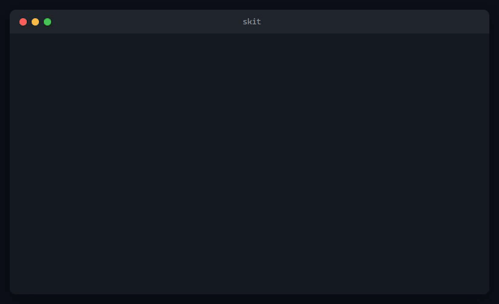

<p align="center">
  <picture>
    <source media="(prefers-color-scheme: dark)" srcset="docs/assets/logo-dark.svg">
    <source media="(prefers-color-scheme: light)" srcset="docs/assets/logo-light.svg">
    
  </picture>
</p>

<p align="center">
  <strong>The package manager for AI agent skills.</strong><br>
  Install, organize, and share skills across Claude Code, Cursor, Windsurf, and more.
</p>

<p align="center">
  <a href="https://www.npmjs.com/package/skit"></a>
  <a href="https://opensource.org/licenses/ISC"></a>
  <a href="https://nodejs.org"></a>
  <a href="#supported-agents"></a>
</p>

---

<p align="center">
  
</p>

---

## Quick Start

```bash
# Install globally
npm install -g skit

# Install skills from a GitHub repo
skit install https://github.com/someone/their-skills

# Clone someone's entire skill setup
npx skit clone snir

# List what you have
skit list
```

---

## Why skit?

AI coding agents support custom skills and rules, but there's no standard way to find, install, share, or update them. skit fixes that.

**Cross-platform** — Works on Windows (NTFS junctions), macOS, and Linux (symlinks). No admin rights required.

**Multi-agent** — Ships with a Claude Code adapter today. Cursor, Windsurf, and VS Code adapters are ~20 lines each.

**Version-tracked** — Every skill knows its origin, version, and update status. Run `skit update` to pull the latest.

**One-command sharing** — `skit clone <user>` replicates anyone's entire skill setup instantly.

**Smart imports** — Paste any URL. skit auto-detects GitHub repos, subfolder paths, gists, and raw files.

---

## Commands

| Command | Description |
|---------|-------------|
| `skit install <url\|path>` | Clone repo or register local folder, scan for skills, interactive picker |
| `skit import <any-url>` | Smart import from gist, GitHub subfolder, or raw URL |
| `skit remove <skill>` | Remove a skill (prompts if last skill from source) |
| `skit remove --source <name>` | Remove all skills from a source |
| `skit list` | Show all skills grouped by source |
| `skit update [source]` | Git pull + re-link (all sources or one) |
| `skit sync` | Recreate all links from manifest (new machine setup) |
| `skit clone <user\|url>` | Fetch profile, install everything |
| `skit profile export` | Export your setup as shareable JSON |
| `skit profile import <file>` | Apply a profile with conflict resolution |
| `skit profile diff <file\|user>` | Show what they have that you don't |
| `skit profile push` | Publish profile to GitHub Gist (requires `gh`) |
| `skit doctor` | Health check: broken links, missing sources, updates |
| `skit link <path>` | Low-level: create link for one skill directory |
| `skit unlink <skill>` | Low-level: remove link only, keep source |
| `skit config set <key> <val>` | Set config (agent, user, skitHome) |
| `skit config get <key>` | Get config value |

---

## How It Works

skit keeps skills in a central library (`~/.skit/`) and creates filesystem links into your agent's skill directory. Your agent sees the skills exactly where it expects them, but skit tracks everything behind the scenes.

```
~/.skit/
├── config.json              # Agent, username, preferences
├── manifest.json            # Single source of truth
├── sources/
│   ├── own/                 # Your repos (--own flag)
│   │   └── my-skills/
│   └── external/            # Third-party repos
│       ├── someone--skills/
│       └── _standalone/     # From skit import
└── profiles/                # Cached profiles

~/.claude/skills/            # Agent target (links only)
├── code-reviewer → ~/.skit/sources/external/someone--skills/code-reviewer
├── my-tool       → ~/.skit/sources/own/my-skills/my-tool
└── quick-doc     → ~/.skit/sources/external/_standalone/quick-doc
```

**Windows**: NTFS junctions (no elevation needed) · **macOS/Linux**: directory symlinks

---

## Install from GitHub

```bash
$ skit install https://github.com/someone/their-skills
```


skit clones the repo, scans for skills (directories containing `SKILL.md`), and presents an interactive picker. Selected skills are linked into your agent's skill directory.

---

## List Your Skills

```bash
$ skit list
```


Skills are grouped by source with their descriptions. Own sources are highlighted separately from external ones.

---

## Clone a Profile

The viral feature. One command to replicate anyone's skill setup:

```bash
$ npx skit clone snir
```



`skit clone` fetches the user's profile from GitHub Gists, clones all source repos, and installs every skill. Share your profile with `skit profile push`.

---

## Smart Import

`skit import` handles any URL format:

```bash
# Full repo → delegates to install
skit import https://github.com/user/repo

# Subfolder → installs just that skill
skit import https://github.com/user/repo/tree/main/skills/my-skill

# Gist → downloads files as a standalone skill
skit import https://gist.github.com/user/abc123

# Raw URL → wraps as standalone skill
skit import https://raw.githubusercontent.com/user/repo/main/skill.md
```

---

## Supported Agents

| Agent | Status | Skill Directory |
|-------|--------|-----------------|
| **Claude Code** | Supported | `~/.claude/skills/` |
| **Cursor** | Planned | `~/.cursor/rules/` |
| **Windsurf** | Planned | `~/.windsurf/rules/` |
| **VS Code** | Planned | TBD |

Adding a new agent adapter is ~20 lines. See `src/agents/claude-code.js` for the pattern.

---

## Skill Format

A skill is a directory containing a `SKILL.md` file with optional YAML frontmatter:

```markdown
---
name: my-skill
description: Use when the user wants to do X
---

# My Skill

Instructions for the AI agent...
```

skit scans for skills at the repo root, one level deep, and in well-known subdirectories (`skills/`, `commands/`, `agents/`).

---

## Health Check

```bash
$ skit doctor

  Checking 8 skills...

  Broken links:
    pr-helper → source missing

  Updates available:
    their-skills: 3 commits behind

  1 issue found. Run 'skit sync' to fix broken links.
```

---

## Comparison

| Feature | skit | AGR | skills-manager |
|---------|------|-----|----------------|
| Cross-platform | Windows + macOS + Linux | macOS + Linux | macOS + Linux |
| Install source | Git repos, gists, URLs, local | Git repos | Local only |
| Multi-agent | Claude Code + extensible | Claude Code only | Claude Code only |
| Profile sharing | `skit clone <user>` | — | — |
| Smart import | Any URL auto-detected | — | — |
| Version tracking | Full manifest | — | — |
| Interactive picker | Checkbox UI | — | GUI |
| Package manager | npm | pip | Tauri binary |

---

## Contributing

Issues and PRs welcome. This is v1 — there's lots of room to grow.

**Roadmap**:
- Community registry with search and trending skills
- Additional agent adapters (Cursor, Windsurf, VS Code)
- `skit init` scaffolding for new skill repos
- Interactive TUI browser

See [`docs/design.md`](docs/design.md) for the full specification.

---

## Credits

Terminal demo GIFs created with [command-giffer](https://github.com/balgaly/command-giffer).

## License

[ISC](LICENSE)
